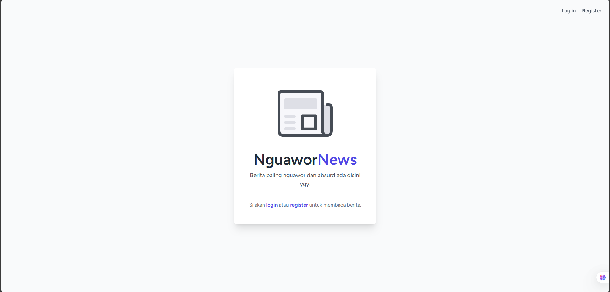
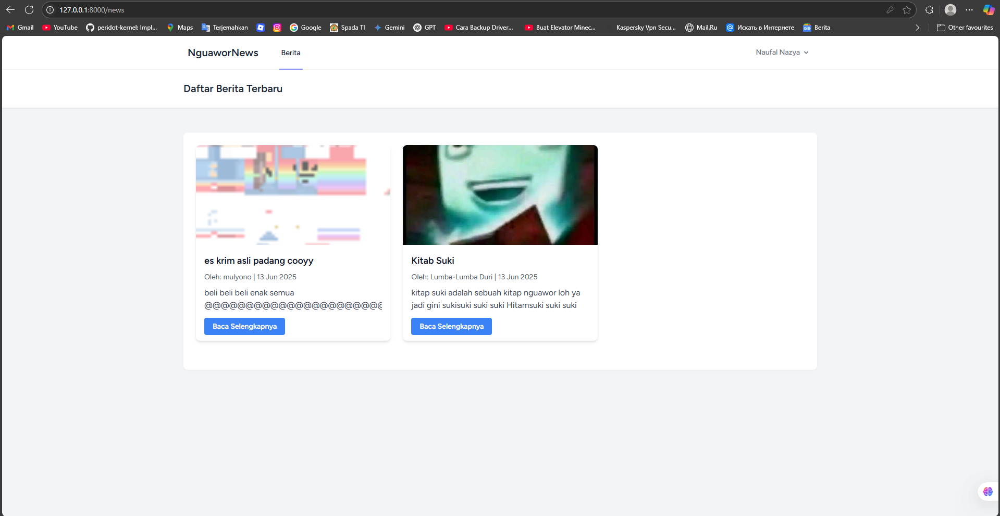
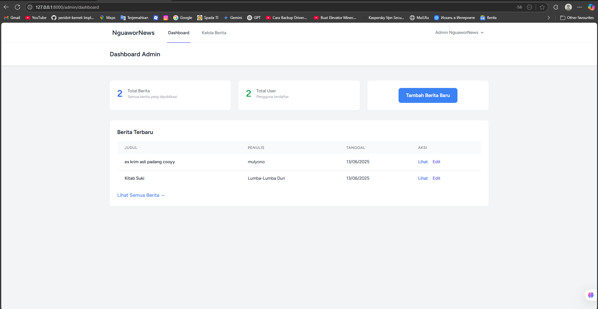

<<<<<<< HEAD
# beritaaa
=======
# 📰 NguaworNews

NguaworNews adalah aplikasi manajemen berita berbasis web yang dibangun menggunakan Laravel 12. Aplikasi ini mendukung autentikasi lengkap, verifikasi email, serta manajemen peran pengguna (Admin & User). Admin dapat mengelola berita, sementara User hanya dapat melihat daftar berita.

---

## ✨ Fitur Utama

- ✅ **Framework Laravel 12:** Menggunakan versi terbaru Laravel dengan performa tinggi.
- 🔐 **Autentikasi Lengkap:** Laravel Breeze (Blade) sudah termasuk login, register, lupa password, dan verifikasi email.
- 📧 **Verifikasi Email:** Pengguna wajib verifikasi email sebelum login.
- 🧑‍💼 **Manajemen Role:**
  - **Admin:** Akses penuh untuk CRUD berita.
  - **User:** Hanya dapat melihat berita.
- 🛠️ **Dashboard Admin:** CRUD berita dengan resource controller Laravel.
- 🧱 **Middleware Role & Verifikasi:** Perlindungan akses hanya untuk admin dan user terverifikasi.
- 🧹 **Validasi Input:** Validasi ketat saat menambah/mengubah berita.
- 💻 **UI Modern:** Dibangun dengan Tailwind CSS & Blade template.
- ⚙️ **Manajemen Frontend:** Menggunakan `pnpm` untuk dependency handling yang efisien.

---

## 🛠️ Teknologi yang Digunakan

| Layer        | Teknologi              |
|--------------|------------------------|
| Backend      | PHP 8.2+, Laravel 12   |
| Frontend     | Blade, Tailwind CSS    |
| Autentikasi  | Laravel Breeze         |
| Database     | MySQL / MariaDB        |
| Build Tool   | Vite + PNPM            |
| Paket PHP    | Composer               |

---

## 🚀 Instalasi & Konfigurasi

### 1. **Prasyarat**
Pastikan sistem Anda telah menginstal:
- PHP ≥ 8.2
- Composer
- Node.js & PNPM
- MySQL / MariaDB

### 2. **Langkah-langkah Setup**

```bash
# Clone repository
git clone https://github.com/Drenzzz/web_manajemen_berita -b quiz1
cd nguawornews

# Install dependency backend
composer install

# Install dependency frontend
pnpm install

# Copy konfigurasi environment
cp .env.example .env

# Generate application key
php artisan key:generate
```

### 3. **Konfigurasi Database**
Ubah `.env` Anda sesuai pengaturan lokal:

```env
DB_DATABASE=nguawor_news
DB_USERNAME=root
DB_PASSWORD=
```

Buat database bernama `nguawor_news`.

### 4. **Konfigurasi Email (Mailtrap.io contoh)**

```env
MAIL_MAILER=smtp
MAIL_HOST=smtp.gmail.com
MAIL_PORT=2525
MAIL_USERNAME=your_mailtrap_username
MAIL_PASSWORD=your_mailtrap_password
MAIL_ENCRYPTION=tls
MAIL_FROM_ADDRESS="hello@gmail.com"
MAIL_FROM_NAME="${APP_NAME}"
```

### 5. **Migrasi & Seeder**
```bash
php artisan migrate:fresh --seed
```

### 6. **Buat Storage Link**
```bash
php artisan storage:link
```

### 7. **Jalankan Aplikasi**

```bash
# Terminal 1: untuk frontend (Vite dev server)
pnpm run dev

# Terminal 2: untuk backend Laravel
php artisan serve
```

Buka: [http://127.0.0.1:8000](http://127.0.0.1:8000)

---

## 👥 Akun Default

| Role  | Email                    | Password  |
|-------|--------------------------|-----------|
| Admin | admin@gmail.com          | 00000000  |
| User  | user@gmail.com           | 00000000  |

> Pengguna baru yang mendaftar akan otomatis memiliki peran `user`.

---

## 📸 Tampilan Aplikasi *(Opsional tambahkan gambar)*

- Halaman Guest


- Dashboard Admin


- Halaman Berita Publik


---

## 📜 Dokumentasi Video

Untuk penjelasan tentang program yang saya buat, bis a dilihat video youtube saya [disini](https://drive.google.com/file/d/1qrLdApfZTkq8HY0nlkKRjE47bVPKxOH6/view?usp=drive_link)
>>>>>>> a2f47e5 (commit awal)
